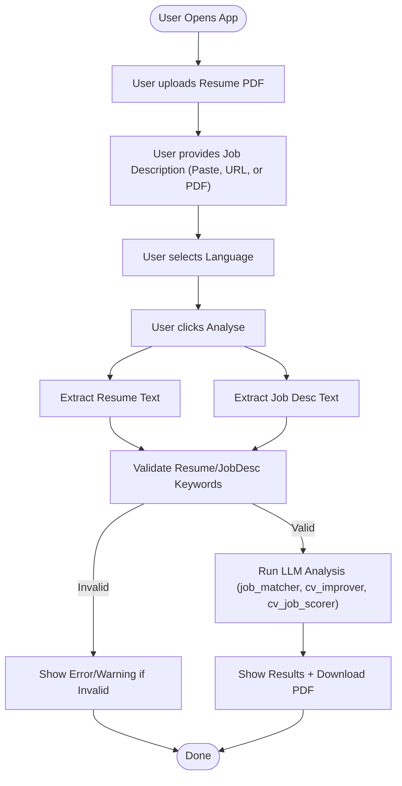

# Carrfella Prototype

Carrfella Prototype is a lightweight Streamlit application that helps job‑seekers instantly evaluate and enhance their resume for any job description.\
Upload your CV (PDF) and drop in a job post (text, URL or PDF), and our LangChain‑powered agent (GPT‑4o‑mini) will return:

1. A detailed **match analysis**
2. **Line‑by‑line improvement** suggestions
3. A clear **fit score**

Finally, download a polished PDF report you can share with recruiters or mentors—all within 30 seconds.

---

## 📊 Program Flow



---

## 🌟 Features
- Accepts resume and job description as PDF, text, or URL
- Supports Bahasa Indonesia and English
- Validates input content for relevance
- Generates a downloadable, combined PDF report

## ⚠️ Limitations
- Only PDF files are supported for upload
- LLM output may vary and is not deterministic
- No strict enforcement of resume/job description format

---

## 🚀 Pre‑flight Setup

```bash
# 1. Clone the repository
git clone https://github.com/naufal1910/carrfella_prototype.git
cd carrfella_prototype

# 2. Create & activate Python virtual env
python -m venv .venv
source .venv/bin/activate  # macOS/Linux
.\.venv\Scripts\activate  # Windows

# 3. Install dependencies
pip install -r requirements.txt

# 4. Create your .env
echo "OPENAI_API_KEY=your_openai_api_key_here" > .env

# 5. (Optional) Run dev server
streamlit run app.py
```

## 📄 Usage

1. **Upload** your resume PDF.
2. **Provide** job description via Text, URL, or PDF.
3. **Select** language (Bahasa Indonesia / English).
4. **Click** Analyze to generate insights.
5. **Download** the combined PDF report.

## 🛠️ Tech Stack

- **Streamlit** for UI
- **LangChain & OpenAI** (GPT‑4o‑mini) for AI logic
- **PyMuPDF** & **BeautifulSoup** for parsing
- **FPDF** for PDF generation

## 🐳 Docker

Build and run in Docker:

```bash
# Build image
docker build -t carrfella .

# Run container (serves at http://localhost:8501)
docker run -p 8501:8501 carrfella
```

---

*This README is aligned with the current MVP implementation and covers only in‑scope features.*

